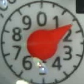
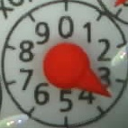
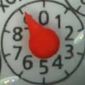

# neural-network-analog-needle-readout
Training and using a neural network to read out the value of an analog display - example including small node server for demonstration

The readout is used in a water meter measurement system. An overview can be found here: [https://github.com/jomjol/water-meter-measurement-system](https://github.com/jomjol/water-meter-measurement-system)

### Versions

### 11.0.3 better quanization
* new images
* quantization in float16 instead of int8 weights

### 11.0.1 New Images

* Updated labeling convention

### 11.0.0 new CNN100 categorical

* relabeled images for better accuracy (used <https://github.com/haverland/collectmeteranalog>)
* new categorical model (ana_i32s100_dropout/ana_i32s100dr-v1.0-q)
* Comparison of all TFLite models (Compare_all_tflite.ipynb)

#### 10.0.0 Reactivate (2021-07-01)

* New Images
* Using Tensorflow 2.9

#### 9.1.0 New Images (2021-11-27)

* New Training

#### 9.0.0 Update Tensorflow (2021-10-29)

* Rollback to Tensorflow 2.4
* New pointer type integrated (half side red)

#### 8.0.0 Update Tensorflow (2021-10-02)

* Update to Tensorflow 2.6

* License change (remove MIT license, remark see below)

  

**ATTENTION: LICENSE CHANGE - removal of MIT License.** 

- Currently no licence published - copyright belongs to author
- If you are interested in a commercial usage or dedicated versions please contact the developer

#### 7.0.0 Added new analog counter type (2021-03-25)

* Retraining of CNN with new images
* Changed file naming

#### 6.3.0 Added new analog counter type (2020-04-09)

* Retraining of CNN with new images
* Refining training image classification (especially in range 5.0 - 9.9)

#### 6.2.0 Added new analog counter type (2020-06-19)
* Retraining of CNN with new analog counter type
* Removal of h5-File

#### [Overview older Versions](Versions.md)

## Problem to solve

An analog needle displays needs to be read out and transfered to digital values as  input for a house automization project. One can do that with classical image processing. Here a neural network approach is shown. This should be more robust for small changes in illumination and image quality and also it was a good training and practise to get into neural networks (training and usage). :-)

The analog meter consists of a scala from 0 to 9, indicator is a clear red pointer showing to the current value. A closer locks shows, that there are two types, with and without tick marks at 0.5 divisions (compare picture 1 and 2). This is ignored in the following.  

   

## Neural Network Approach

Convolutional Neural Networks (CNN) are very promiment in image processing. Especially in classification of image content, e.g. identify objects (dog, cat, car, bike, ...) or classify hand written letters.

A classic approach would be to use a classification CNN with 10 output classes representing the 10 digits from 0 to 9. This will work fine, but for the usage of the readout later on also the subdigit readout with one digit after the comma is needed. This would imply 100 classes (0.0, 0.1, ..., 9.8, 9.9) with a high number of pictures for training for each class.

Therefore another approach was used finally: a CNN network with only one output neuron in the final layer trained to the target value. This allows continous values for the output.

Remark: technical the output is normalized to 1, so the expected value is between 0.00 to 0.99. The final output needs to be muliplied with the max value (e.g. x10).

| Picture        | Value           | Picture        | Value           | Picture        | Value           | Picture        | Value           |
| ------------- |:-------------:| ------------- |:-------------:|------------- |:-------------:| ------------- |:-------------:|
|  | 1.6 |  | 7.4 | | 3.5 |  | 9.2 |

### Labeled Training Data

The images are coming from a camera system described elsewhere ([Overview](https://github.com/jomjol/water-meter-measurement-system), [HW](https://www.thingiverse.com/thing:3238162), [SW](https://github.com/jomjol/water-meter-picture-provider)). One major effort is to label the pictures with the target value. The labeling is done with a classic picture analyses and partically by hand. Finally more than 2800 labeled pictures are available. The picture are rescaled to 32x32 pixels with RGB color (3 channels).

The resized pictures (subfolder Train-CNN_Analog-Needle-Readout/data_resize_all) as well as the original pictures (zipped in file "data_raw_all.zip") are included in the dataset.

The project consists of two parts:
1. Training the network
2. Using the trained network within a simple http-server

## Training the network

The training is done using Keras in a python environment. For training purpuses the code is documented in Jupyter notebooks. The environment is setup using Ananconda with Python 3.7[1]. 

The training is descibed in detail in: **[How to train the network](Train_Network.md)**.

The trained network is stored in the Keras H5-format and used as an input for a simple usage

## Investigations on CNN-Parameters
This CNN gives a great playground to investigate the influence of different parameters like number of layers, size of single layers, ...
First "investigations" can be found in the subdirectory background_info within the training section: [/background_info/](/background_info/)

Hopefully you have fun with neural networks and find this usefull. 

**Any questions, hints, improvements are very welcome through the GitHub channel**

Best regards,

**jomjol**

[1]: The following book is found very usefull for background, basic setting and different approaches:  
Mattheiu Deru and Alassane Ndiaye: Deep Learning with TensorFlow, Keras, und Tensorflow.js

