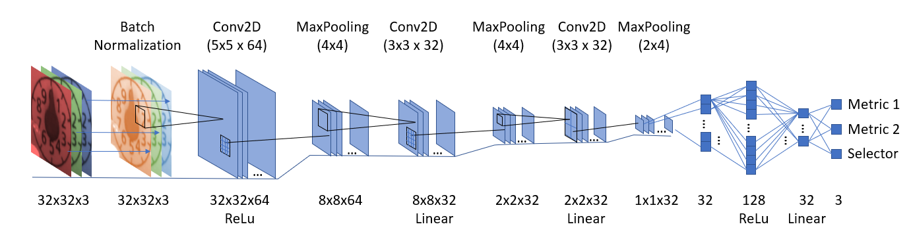
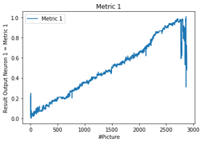
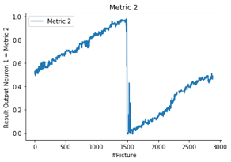
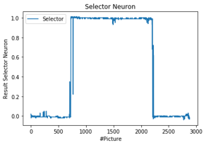
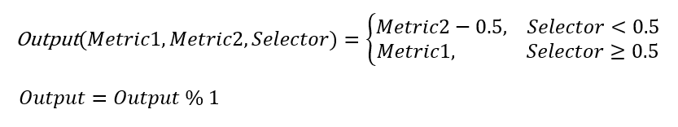
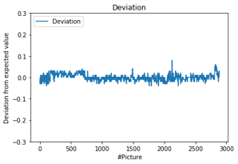

# CNN with periodic loss functin - Training the CNN neural network
Details on setup and training of the CNN neural network

## Network Structure
The network consists of several Conv2D, MaxPooling and Flatten Layers:

The structure is basically the same as in [Version 1](CNN_Version1.md). Two changes were applied: 
1. Change to 3 output neurons
2. Double the number of neurons in second last layer from 16 to 32

The 2nd change showed impirical a much better accuracy. Somehow reasonalbe, as now double the information with perpendicular output neurons and a selector neuron is expected.

#### Loss Function
Here the loss function is a simple mean-square-distance. The inaccuracy at the switching points does not matter any more, as the opposit metric neuron is used at this points.

## Training Data
Same approach as in [Version 1](CNN_Version1.md):

The training data consists of images of the analog pointer with the size of 32x32 pixels and RGB color code. The expected readout value is encoded in the filename itself. Details can be found [Training_Data.md](Training_Data.md)

For reshaping the images the following code can be used: [Image_Preparation.ipynb](Image_Preparation.ipynb)

## Training strategy

The details can be found in the Jupyter file itself: ***[Train_CNN_Analog-Readout_Version2.ipynb](Train_CNN_Analog-Readout_Version2.ipynb)***

The following aspects are implemented:

#### Scattering input images
Scattering the input images by brightness as well as a pixel shift for training variations improved the stability of the network a lot.

Brightness was scattered with +/-30%

The position was scattered with +/-1 pixel in each direction. As the original picture is more than 4 times bigger (142x142 pixel) this ensures enough uncertainty to the upstream image alignment and cut out procedure.

## Results

The results show the expected behaviour:

| Metric 1        | Metric 2           | Selector Neuron        |  
| -------------- |:---------------:| -------------- |
|  |  | |

It can be seen that the switching points are around "0.0" = "1.0" (Metric 1), respectivly "0.5" (Metric 2). Also the selector has its ambigious point at "0.25" respectively "0.75". But as these points are orthogonal to each other, the combinded output will therefore have no error due to this.

Using the threshold of the selector right in the middle (e.g. 0.5) will choose the right metric. Because it clearly discriminates the switching point. If the selector itself is at its switching point, it does not matter which metric to choose, because there the metric have continous and equal results.
You just have to take into account the offset of 0.5 of the second metric and a Modulo-Operator to ensure, that the output is between 0 and 1:

Checking the combinded output by the deviation by a comparison to the label shows, that the error is very small. The statistic shows an average value of 0.05%+/-1.4% with a maximum deviation of 8%. With respect to the pointer, that means that the error is in the subdigit range in the maximum (< 10%).

### Deviation from expected value

