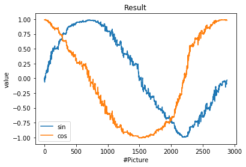

# CNN with periodic loss functin - Training the CNN neural network
Details on setup and training of the CNN neural network

## Network Structure
The network consists of several Conv2D, MaxPooling and Flatten Layers:

## Training Data

The training data consists of images of the analog pointer with the size of 32x32 pixels and RGB color code. The expected readout value is encoded in the filename itself. Details can be found [Training_Data.md](Training_Data.md)

For reshaping the images the following code can be used: [Image_Preparation.ipynb]

## Training strategy

The details can be found in the Jupyter file itself: ***[Train_CNN_Analog-Readout_Version2.ipynb](Train_CNN_Analog-Readout_Version2.ipynb)***

The following aspects are implemented:

#### Scattering input images
Scattering the input images by brightness as well as a pixel shift for training variations improved the stability of the network a lot.

Brightness was scattered with +/-30%

The position was scattered with +/-1 pixel in each direction. As the original picture is more than 4 times bigger (142x142 pixel) this ensures enough uncertainty to the upstream image alignment and cut out procedure.

## Results

The results show the expected behaviour:

| sinus / cosinus        | Orginal / Prediction           | 
| -------------- |:---------------:| 
|  |  |

Checking the combinded output by the deviation by a comparison to the label shows, that the error is very small. The statistic shows an average value of 0.05%+/-1.4% with a maximum deviation of 8%. With respect to the pointer, that means that the error is in the subdigit range in the maximum (< 10%).

### Deviation from expected value

Checking the deviation by a comparison to the label shows, that the error is very small. The statistic shows an average value of 0.0%+/-0.7% with a maximum deviation of 2.5%. With respect to the pointer, that means that the error is in the subdigit range in the maximum +/-0.25 over the full range.

