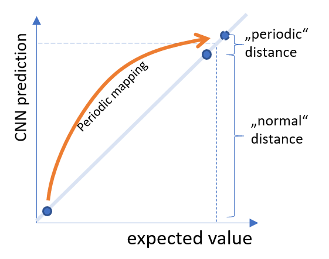
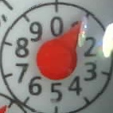
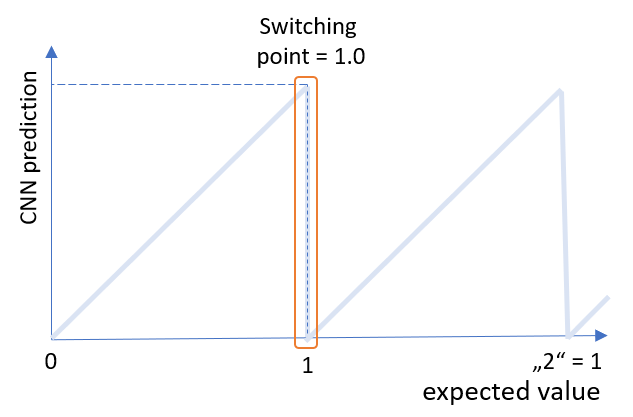
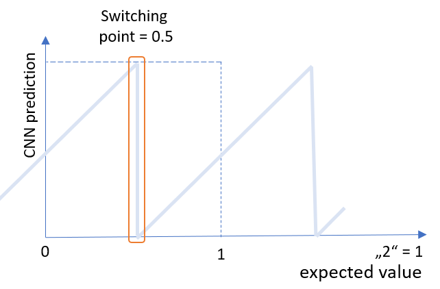
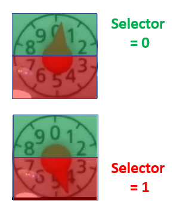

# Training the CNN neural network
Details on setup and training of the CNN neural network

## Version
##### [1.0 Initial Version](CNN_Version1.md)
* CNN with one output and periodic loss function
* Problem with pointers pointing straight updwards (12 o'clock) due to ambigioutiy of 1.0 and 0.0 in the output
##### [2.0 CNN with 2 outputs and selector](CNN_Version2)
* Solved the problem of ambigioutiy by introducing 2nd output and selector neuron
##### [2.1 CNN with 2 outputs and selector](CNN_Version2)
* Improve stability and accuracy by increasing neurons in last layer from 32 to 48 and change the activation function to "relu" instead of "linear"

## Software Environment
The training is done using Keras in a python environment. For training purpuses the code is documented in Jupyter notebooks. The environment is setup using Ananconda with Python 3.7.

## Basic Problem of ambiguous input to output mapping

A very basic problem in this kind of data evaluation is the periodic nature of an analog counter. The images of a counter pointing to an value of 9.9 is very similar to a picture pointing to 0.0.

But with respect to the output value they are mapped on the two extrema of the scala, maximum separated:

| Picture        | Value           | Picture        | Value           | Picture        | Value           | 
| -------------- |:---------------:| -------------- |:---------------:| -------------- |:-------------:| 
|  | 0.97 |  | 0.02 | | 1.0 or 0.0 ?|

A standard metric would measure a maximum difference between picture 1 and picture 2. For the last picture it is even for a human eye not possible to distingues if it's rather to the left or to the right.

### Periodic loss function (Version 1)

I have tackled this problem first with a periodic loss function. Which means, that the loss function of the CNN itself takes care about the ambigouity of the two values (9.9 and 0.1 have the same distance to 0):

The periodic loss improved the convergence and the quality a lot. The details on training the CNN with a periodic loss cfunction can be found here [CNN_Version1.md](CNN_Version1.md).

 Never the less it turned out, that it is still not enough.

#### Problem of periodic loss
Let's take the mathematic of CNN into account: 
* The equations between the layers are linear superpositions of  weights and activation states of neurons
* The activation functions of a neuron used here are of continuous charachter
This means, that between input and output is a continuous relation. So if you have one input image, that results in 0.99 and another resulting in 0.00, you can always find a sligth modification between these two images, that result in any value in between these two extremas. That means, that at the switching point the output of a continuous equation system cannot be accurate.

Experimental inverstations showed, that using a periodic loss function increasess the steppness at the switching point, but in general cannot resolve it. So from time to time there is an inaccurate result, disturbing the system.

There is a trick and rather simple extension of the CNN to circumvent this problem - see next chapter

### Two outputs and a selector (Version 2)

The problem is not the incontinuity at value 0.99 to 0.00. There is not discontinuity in any pictures around that value, but at some point you need to make a cut in the digital values. The discontinouty can be shifted to any value, e.g. to a pointer showing the value 0.50 (directing downwards) by adding 0.5 modulo 1 to the expected value. You still have a unique mapping, just with an offset of 0.5: 

|                     Image                    |  Metric 1 Value |  Metric 2 Value |
|:--------------------------------------------:|:---------------:|:---------------:|
|  | 0               | 0.5             |
|  | 0.1             | 0.6             |
| ...                                          |                 |                 |
|  | 0.4             | 0.9             |
|  | 0.5             | 0.0             |
|  | 0.6             | 0.1             |
| ...                                          |                 |                 |
|  | 0.9             | 0.4             |

The two metrics are shown here:

|  Metric 1 |  Metric 2 |
|:--------------------------------------------:|:---------------:|
|                 |               |

This makes directly clear, that the switching point of unambigious values switches from 0 (pointer upwards) to 0.5 (pointer downwards). At all other points the values is continious and therefore reliable.
 
So there only remains the problem, of how to select which of the two metrics to use in a concrete case. This can be easily solved by adding a selector neuron. This is giving a "0" if the pointer is in the upper half and a "1", if the pointer is heading downwards.

Also this selector has a unabigious value around 0.25 and 0.75. But there it does not matter which metric to used as both are valid and giving reliable results.

The only drawback of this approach with 3 output neurons is, that you have to process the output through a simple algorithm, switching between the two metrics, depending on the selector neuron.

The modulo operator ensures, that the result is between 0 and 1 reflecting the periodic nature.

Details on training the network can be found here [CNN_Version2.md](CNN_Version2.md)
