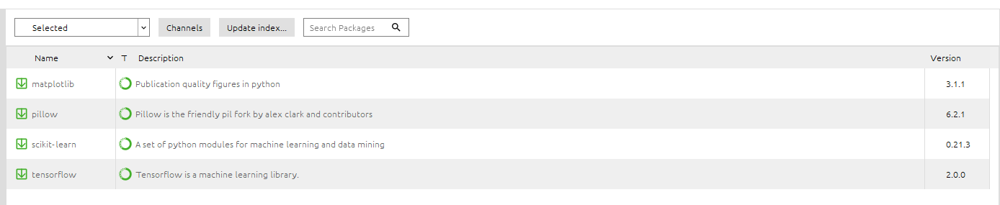

# Setup of Training Environment in Windows System
Step-by-Step instruction for setting up an Python Environment for training and testing the Neural-Network-Notebooks

## Software Environment
This tutorial has been tested on a Windows 10 envirmonment. 

### Step 1 - Ananconda
First install Ananconda on your system to get a working Python base environment.

### Step 2 - Python Environment
Create within Ananconda a new environment with Python 3.7:

### Step 3 - Install Python Libraries
* tensorflow
* pillow
* matplotlib
* scikit-learn

Using the Ananconda installation for installation:

### Step 4- Activate Jupyter Notebooks
Go to tab "Home":

and install the Jupyter-Environment:

### Step 5 - Start Jupyter and get working ...
Ensure, that you are still in the right Environment (see "Application on") and start Jupyter:

# That's it!

