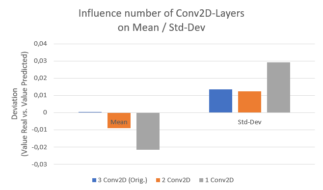
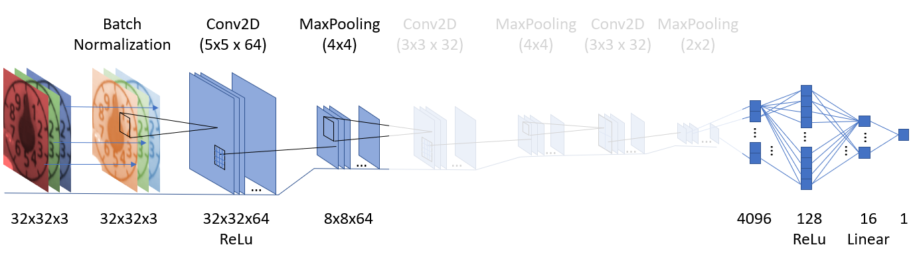

# Investigations on CNN-Structures

Here first very simple investigations on CNN parameters are shown.

## Number of layers
The used net consists of three Conv2D layers alternated with MaxPooling and afterwards a flattening. What happens, if the number of Conv2D is reduced?

The mean value increases from 0% to -2% deviation, almost linear. The standard deviation  But the standard deviation is unchanged when removing one Conv2D layer, but increased strongly to 3% by only using 1 Conv2D layer

| Deviation        | CNN-Structure           |
| ------------- | --------------- |
|  |   |
|  |   |
|  |   |

Looking on the deviation, one can see, that the standart deviation ("roughness") increases with decreasing number of layers.

Corresponding Juypiter-Files:

| CNN | Link |
| -------- | ---- |
| 3 Conv3D (Original) | [00a_Original.ipynb](jyupiter_files/00a_Original.ipynb) |
| 2 Conv3D  | [07a_CNN-LessLayer-1.ipynb](jyupiter_files/07a_CNN-LessLayer-1.ipynb) |
| 1 Conv3D  | [07a_CNN-LessLayer-2.ipynb](jyupiter_files/07a_CNN-LessLayer-2.ipynb) |

## Number of neurons in the layers

How many neurons are needed in one layer? The number in a layer was choosen to be to the power of 2. So the next graphs shows a variation of this number of neurons in each layer. The input layer (32x32x3) and the output layer (1) was naturally unchanged.

| Model | Conv2D_1 | Conv2D_2 | Conv2D_3 | Flatten | Linear | Output |
| ----- | -------- | ----- | ---- | ----- | ---- | ----- |
| Bigger x2 | (128, (5, 5)) | (64, (5, 5)) | (64, (3, 3)) | 256 | 32 | 1 |
| Original |  (64, (5, 5)) |
| Smaller 0,5 |  (32, (5, 5)) |
| Smaller 0,25 |  (16, (5, 5)) |
| Smaller 0,125 |  (8, (5, 5)) |
